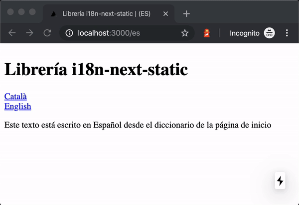

# i18n-next-static

i18n-next-static is a Next.js utility to translate pages without the need of a server (static i18n pages generator).

The main goal of this library is to keep the translations as simple as possible in a Next.js environment. 

This library is very tiny (~1kb). 




## How it works?

Instead of working on `/pages` directory to write our pages, we are going to generate this folder before build the app, an each page will be have all the necessary translations from the locale.

So imagine that we are working in an alternative `/pages_` to build our pages:

**/pages_**

```bash
.
├── about.js
├── index.js
└── nested
    └── index.js
```

And when we build the app, this **/pages** is automatically generated:

```bash
.
├── about.js
├── ca
│   ├── about.js
│   ├── index.js
│   └── nested
│       └── index.js
├── en
│   ├── about.js
│   ├── index.js
│   └── nested
│       └── index.js
├── es
│   ├── about.js
│   ├── index.js
│   └── nested
│       └── index.js
├── index.js
└── nested
    └── index.js
```

And each page and page children can consume the translations with the hook `useTranslation`.

```js
const { t, lang } = useTranslation()
const title = t('common:title')
```

## Getting started

### Add this lib to your project

* `yarn install i18n-next-static`

And then, in your **package.json**:

```json
"scripts": {
  "dev": "yarn i18n && next dev",
  "build": "yarn i18n && next build",
  "start": "next start",
  "i18n": "node ./lib/builder.js"
}
```

### Create /locales directory with translations JSONs

The locales directory should be like: 

**/locales**

```bash
.
├── ca
│   ├── common.json
│   └── home.json
├── en
│   ├── common.json
│   └── home.json
└── es
    ├── common.json
    └── home.json
```

And each locales file is like:

```json
{
  "title": "Hello world",
  "variable-example": "Using a variable {{count}}"
}
```

### Use translations in your pages

First, define in the `/i18n.json` the namespaces of the page:

```json
{
  "pages": {
    "/index.js": ["common", "home"]
  }
}
```

Then, use translations in the page / children page component:

```jsx
import useTranslation from 'i18n-next-static/useTranslation'
// ...
const { t, lang } = useTranslation()
const example = t('common:variable-example', { count: 42 })
// ...
return <div>{example}</div>
```

When the final i18n key to use in the code will be `common:title`, when the namespace `common` is the name of the file, and `title` the translation key.

### Add /pages to .gitignore

`/pages` directory is going to be generated every time based on `/pages_`, so is not necessary to track in git.

## Configuration

Configuration file `i18n.json` in the root of the project:

```json
{
  "defaultLanguage": "en",
  "currentPagesDir": "pages_",
  "finalPagesDir": "pages",
  "localesPath": "locales",
  "pages": {}
}
```

### defaultLanguage

String with the ISO locale ("en" as default).

### currentPagesDir

String with the directory that you have the pages code ("pages_" as default).

### finalPagesDir 

String with the directory that is going to build the pages. Only "pages" and "src/pages" is possible. ("pages" as default).

### localesPath

String with the directory that are the JSON locales. ("locales" as default).

### pages

Is an object that define the namespaces used in each page.

Example:

```json
{
  "pages": {
    "/index.js": ["common", "home"]
  }
}
```

## How to run the example of this repo

* `yarn install`
* `yarn dev`
